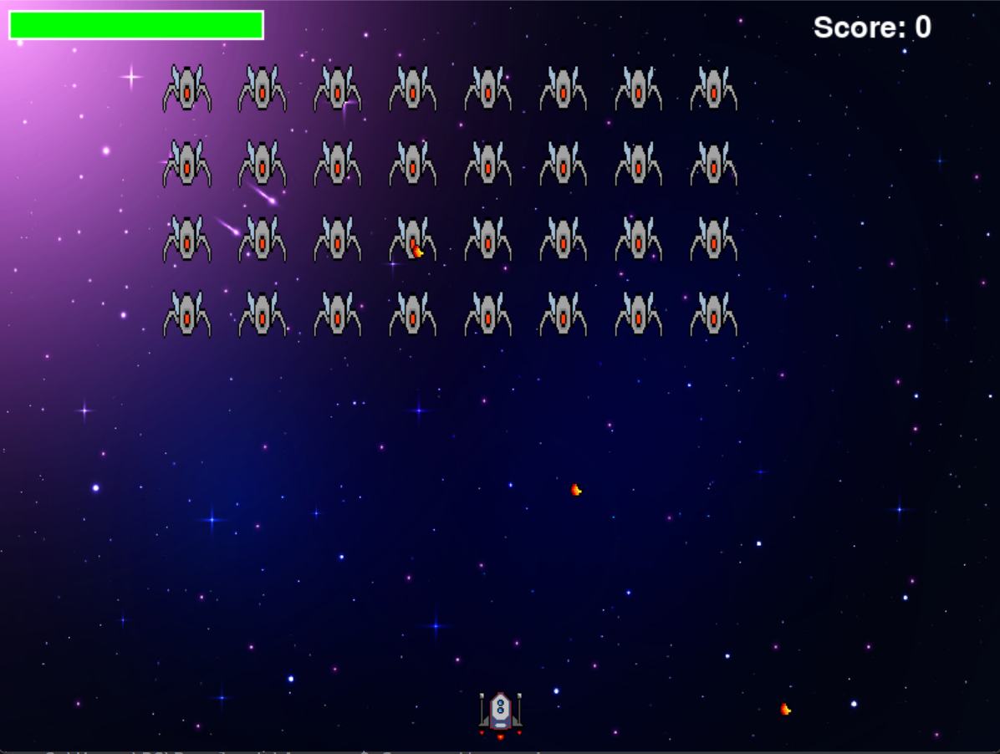

# Space Shooter Game

An action-packed space shooter game built with Pygame where you control a spaceship and must defeat waves of enemy ships while avoiding their attacks.

<p align="center">
  
</p>

## Features

### Game Modes
- **Start Screen**: Main menu with options to start the game or view tutorial
- **Tutorial**: Learn game controls and objectives
- **Main Game**: Fast-paced shooting action
- **Victory/Game Over Screen**: Shows final score with options to play again or return home

### Gameplay Elements
- **Player Health System**: 150 HP with visual health bar
- **Scoring System**: +1 point for each enemy destroyed
- **Dynamic Combat**:
  - Player rapid-fire system (300ms cooldown)
  - Enemy formation with 32 ships (4 rows × 8 columns)
  - Enemies shoot every 10 seconds (randomized to prevent sync)
  - Enemy ships patrol horizontally within their zones

### Visual Features
- Customizable background
- Smooth animations
- Health bar with color feedback
- Score display
- Semi-transparent game over overlay

## Requirements

- Python 3.x
- Pygame library

## Installation

1. Ensure Python 3.x is installed on your system
2. Install Pygame using pip:
```bash
pip install pygame
```
3. Place the required game assets in the `Assets` folder:
   - `player.png`: Player spaceship sprite
   - `enemy.png`: Enemy spaceship sprite
   - `player-bullet.png`: Player's projectile
   - `enemy-bullet.png`: Enemy's projectile
   - `background.jpg`: Game background (optional)

## How to Play

1. Launch the game:
```bash
python main.py
```

2. From the start screen, choose:
   - **Start**: Begin a new game
   - **Tutorial**: View game instructions

### Controls
- **Left/Right Arrow Keys**: Move ship horizontally
- **Spacebar**: Fire weapon
- **Mouse**: Navigate menus

### Objectives
- Destroy all 32 enemy ships to achieve victory
- Avoid enemy bullets to maintain health
- Achieve the highest score possible

### Victory Conditions
- Destroy all enemy ships
- Maintain health above 0

### Defeat Conditions
- Health reaches 0
- Too many enemy ships reach the bottom

## Project Structure

- `main.py`: Core game loop, state management, and UI
- `player.py`: Player ship mechanics and bullet system
- `enemy.py`: Enemy AI, formation management, and attack patterns
- `Assets/`: Game sprites and resources

## Development

The game is built with a modular structure for easy maintenance and expansion:
- Separate classes for Player, Enemy, and Bullet entities
- State-based game flow management
- Configurable game parameters for easy balancing
- Fallback sprites if image assets are missing

## Credits

Built with Pygame - A free and open-source Python game development library.